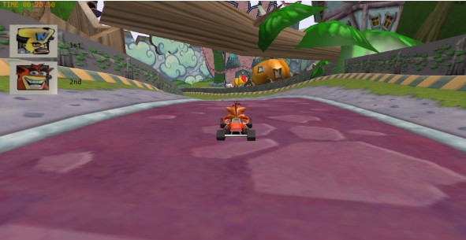
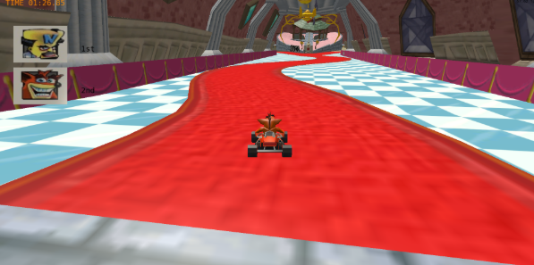

# Computação Gráfica e Visualização I (INF01047) - INF/UFRGS

Este repositório contém o código base para o trabalho final. O enunciado completo do trabalho final está no Moodle:

https://moodle.ufrgs.br/mod/assign/view.php?id=6018620


## Relatório

Abaixo, imagens do jogo desenvolvido em funcionamento:





### Aplicação desenvolvida

Crashando de Carros consiste em uma aplicação gráfica que visa simular, de forma simplificada, o jogo Crash Nitro Kart de Playstation 2, um jogo de corrida com os personagens caricatos da franquia Crash. Implementamos a cópia de um mapa: Once Upon a Tire. Há dois personagens: o Crash, controlado pelo jogador, e o Cortex, NPC adversário. O objetivo do jogo é ser o primeiro a completar 2 voltas pela pista, podendo ganhar ou perder. Há câmeras em terceira e primeira pessoa. Os comandos podem ser realizados tanto pelas teclas W,A,S,D assim como por controle genérico USB. 

### Contribuições de Cada Membro

Os membros trabalharam de forma fluida, de forma que suas responsabilidades se misturam em alguns aspectos. Porém, podemos elencar dados principais abaixo:

**Kauan Rakoski**

- Adição de modelos do Crash e Cortex com seus carros
- Criação de um modelo de entidade que abstrai as aplicações matriciais
- Movimentação dos carros baseado em inputs do usuário
- Implementação da Trilha Sonora 
- Criação do sistema particular que gera a fumaça
- Implementação dos checkpoints e sistema básico de vitória

**Pedro Schuck**

- Modelos de Iluminação
- Implementação das Texturas do Mapa
- Instanciação de Caixas
- Implementação de Curvas de Bezier para a Cutscene da câmera
- Câmera em terceira pessoa e olhando para trás

De modo geral, creio que ambos avaliem a colaboração como positiva.

### Paragrafo Avaliando uso de IA generativa

Dado a liberação de uso, os membros usaram IA para consulta e para acelerarem seu trabalho. O principal uso de IA está na geração do mapa - arquivo trackMap.cpp - onde a implementação foi totalmente executada com uso de um agente de código (AntiGravity) usando o modelo Gemini 3.1 Pro (High). 

Inicialmente, foi uma surpresa o agente ter implementado algo complexo tão rápido, porém com o decorrer do tempo o grupo percebeu que tal implementação não era satisfatória. Além de conter bugs de colisão e renderização de texturas, o agente foi incapaz de resolvê-los completamente (ao corrigir algo, piorava outro aspecto). O fato de terceirizar essa operação de geração também deixou a equipe distante da lógica de pensamento e teve de ser gasto um tempo grande para compreender o artefato gerado. 

Junto à isso, para tentar corrigir bugs, uma sequência de prompts no estilo "It is still wrong, fix" teve de ser feita (omitida do arquivo prompts.md), mesmo com descrições ligeiramente claras de implementação. Desse modo, avalio (Kauan Rakoski) que a geração com IA está longe de ser 100% viável, pois além de parecer depender de sorte, afasta o desenvolvedor do código, e o que ganha de tempo sacrifica em qualidade. Talvez com orquestrações de agentes seja melhor, porém se precisa gastar muito tempo configurando agentes, acho que compensa mais gastar esse tempo escrevendo código.

Em seções mais pequenas e com escopo bem delimitado, porém, o uso de agentes fornece bons resultados com uma implementação rápida.

### Manual de como jogar o jogo

Para a movimentação do personagem:

- `W`, `A`, `S`, `D` para frente, esquerda, trás (ré) e direita. Alternativamente, Joystick esquerdo em controles.\
- `X` para acelerar e `Quadrado` para ré, no controle.
- `1` para câmera em primeira pessoa, no computador
- `2` para câmera em terceira pessoa, no computador
- `3` para câmera olhando para trás, no computador
- Teclas `p` e `o` para alternar entre projeção perspectiva e ortográfica, no computador
- `r` para reiniciar o jogo, assim que ganha ou perde
- `esc` para encerrar a aplicação 

### Comandos de compilação

No windows, tendo o cmake configurado, pode-se utilizar os seguintes comandos:

```
cmake --build build
cd bin/debug
./main
```

Alternativamente, pode-se usar o script `run.cmd` que executa os comandos acima. 

### Comentários Importantes

Os prompts utilizados haviam sido descritos em um arquivo prompts.md. Em algum momento do desenvolvimento, este arquivo se perdeu e perdemos alguns dos prompts, que foram reconstituidos depois. As funções executadas por IA estão documentadas, e prompts que usam agentes especificam. 

Caso haja alguma falta de especificação, gostariamos de esclarecer que se trata de descuido nos detalhes e não ato de má fé. O grupo se dispõe a esclarecer quaisquer assuntos referentes ao uso de IA generativa.