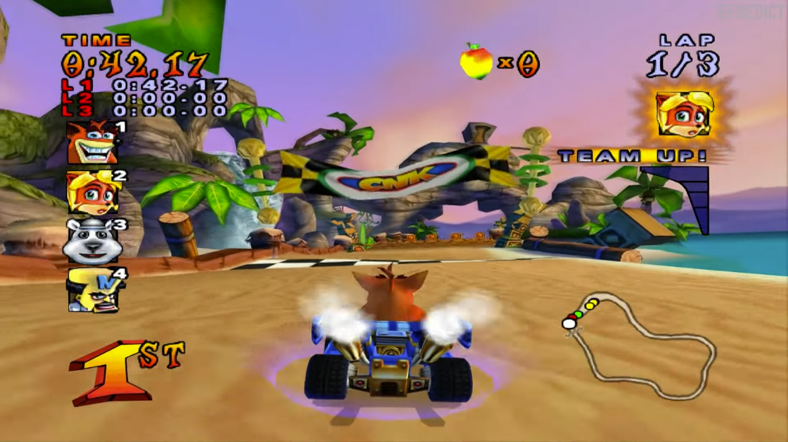
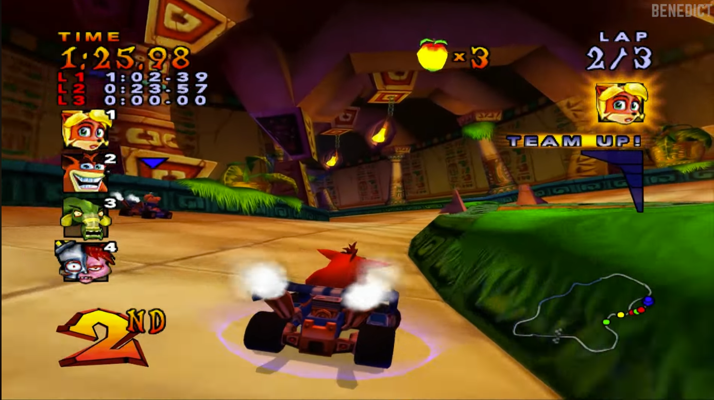
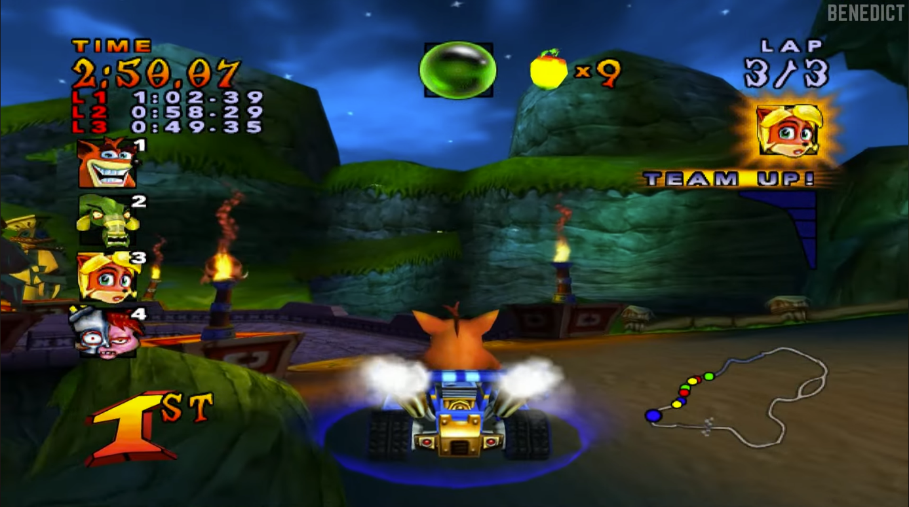

# Especificação da Implementação

> [!CAUTION]
> - Você <ins>**não pode utilizar ferramentas de IA para escrever esta
>   especificação**</ins>

## Integrantes da dupla

- **Aluno 1 - Nome**: <mark>`KAUAN RAKOSKI`</mark>
- **Aluno 1 - Cartão UFRGS**: <mark>`00588935`</mark>

- **Aluno 2 - Nome**: <mark>`Pedro Schuck`</mark>
- **Aluno 2 - Cartão UFRGS**: <mark>`00587553`</mark>

## Detalhes do que será implementado

- **Título do trabalho**: <mark>`Crashando de Carros`</mark>
- **Parágrafo curto descrevendo o que será implementado**: a intenção deste trabalho é implementar parcialmente, isto é, com simplificações em relação ao original, um mini jogo inspirado em Crash Nitro Kart de Playstation 2, onde o jogador poderá controlar o seu carro e competir contra NPCs com o objetivo de ser o primeiro a completar uma volta na pista.

## Especificação visual

### Vídeo - Link

O trabalho se baseará no jogo cuja gameplay pode ser vista em https://youtu.be/gd36DKfgMyM?si=DG_82_qhnTSnQm2V.

### Vídeo - Timestamp

> [!IMPORTANT]
> - Coloque aqui um **intervalo de ~30 segundos** do vídeo acima, que
>   será a base de comparação para avaliar se o seu trabalho final
>   conseguiu ou não reproduzir a referência.

- **Timestamp inicial**: <mark>10:45</mark>
- **Timestamp final**: <mark>11:15</mark>

### Imagens

> [!IMPORTANT]
> - Coloque aqui **três imagens** capturadas do vídeo acima, que você
>   irá usar como ilustração para as explicações que vêm abaixo.

## Especificação textual

Para cada um dos requisitos abaixo (detalhados no [Enunciado do Trabalho final - Moodle](https://moodle.ufrgs.br/mod/assign/view.php?id=6018620)), escreva um parágrafo **curto** explicando como este requisito será atendido, apontando itens específicos do vídeo/imagens que você incluiu acima que atendem estes requisitos.

### Malhas poligonais complexas
Serão carregados modelos 3D no formato .obj utilizando a biblioteca tiny_obj_loader. A cena contará com as malhas estruturais do personagem principal (Crash e seu kart Trikee), do inimigo (Cortex e seu carro) e a geometria do cenário (pista/plano), correspondendo aos modelos complexos vistos nas imagens de referência - ou, melhor posto, similares encontrados disponíveis em modelos online. Posteriormente, mais objetos poderão ser adicionados - e.g. caixas ou mais NPCs.

### Transformações geométricas controladas pelo usuário
O movimento do carro principal (jogador) será feito via teclado (W,A,S,D) e possivelmente via controle, se houver compatibilidade. A direção será controlada definindo a rotação (esquerda, direita) e a velocidade (W - vetor forward - ou S, dando ré ao carro).

### Diferentes tipos de câmeras
O jogo contará com duas câmeras diferentes. Uma delas será uma câmera do tipo Look-At que se baseará em um vetor forward (que aponta a direção para onde o crash está olhando), implementando uma câmera de terceira pessoa que acompanha o jogador pelas costas. A outra câmera consistirá em uma visualização em primeira pessoa da perspectiva do personagem principal (Crash).

### Instâncias de objetos
O código irá se basear em um modelo de Entidades (buscando principalmente gerar um código Orientado a Objetos e facilitar escalabilidade), permitindo o reaproveitamento de modelos através da instânciação de diferentes "objetos", mudando apenas suas matrizes essenciais e atributos.

### Testes de intersecção
Em primeiro momento, ao menos, o jogo irá se basear em interseções calculadas a partir de AABBs (axis-aligned-bounding-boxes). Tais AABBs serão utilizadas para verificar (e reagir) a colisões entre carros, carros e objetos e carros e chão - efetivamente criando um pequeno sistema de gravidade.

### Modelos de Iluminação em todos os objetos
Todos os objetos serão iluminados por pontos de iluminação local, simulando trechos mais escuros e claros da pista. Para atingir tal efeito, pretendemos fazer uso do modelo de iluminação de Phong aplicado a cada pixel em conjunto com pontos de luz individuais espalhados pela pista.

### Mapeamento de texturas em todos os objetos
Todos os personagens e objetos que fazem parte do cenário da pista (plantas, rochas, caixas e etc) possuirão alguma textura. Dessa forma, buscaremos texturas idênticas ou similares para replicar da forma mais próxima possível as cenas originais no jogo em si.

### Movimentação com curva Bézier cúbica
Inicialmente considera-se modelar o movimento do Cortex (npc inimigo) e demais NPCs, caso venham a ser adicionados, através de uma curva Bézier. Caso, por algum motivo, tal sugestão seja abandonada, essas curvas serão utilizadas para modelar o comportamento de coletáveis, como caixas e frutas de pontos.

### Animações baseadas no tempo ($\Delta t$)
A física do jogo se baseará em tempo, aplicando efeitos dependentes de uma variável global de tempo, como por exemplo uma força de repulsão entre os carros que diminui conforme o atrito simulado dos pneus com o solo - dando a impressão de colisão real - e o sistema de gravidade, que utiliza aceleração baseada em tempo. 

## Limitações esperadas

> [!IMPORTANT]
> - Coloque aqui uma lista de detalhes visuais ou de interação que
>   aparecem no vídeo e/ou imagens acima, mas que você **não pretende
>   implementar** ou que você **irá implementar parcialmente**.
> - Para cada item, **explique por que** não será implementado ou por
>   que será implementado parcialmente.

**Física Complexa de Derrapagem:** A referência possui mecânicas complexas de derrapagem, turbo e física em geral. Como este não é o escopo da disciplina, não será nosso foco e implementaremos de modo simplificado.

**Animações Esqueletais:** No jogo, há animações complexas de personagem ou carros (exemplo: crash contorcendo-se ao girar o volante). No trabalho, os modelos 3D serão estáticos, dado a maior facilidade para encontrar arquivos deste estilo já que o foco não é a produção de modelos.

**Efeitos visuais e partículas:** Efeitos visuais mais complexos e particulares (como o fogo saindo do escapamento) não constam como objetivo da aplicação, para permitir um foco maior em outros componentes.

**Mapa Simplificado:** O Crash Nitro Kart possui mapas extensos e com variado relevo. A intenção é implementar um mapa desses, mas caso se mostre uma tarefa muito complexa, mapas simplificados serão utilizados no lugar, para a equipe ter mais tempo para trabalhar em outros aspectos.

**Interface e Power-ups simplificados:** O jogo original possui uma grande variedade de power-ups e uma interface bem completa (posição dos jogadores, acompanhamento em tempo real no mapa, demonstração do power up atual). Implementaremos uma interface simplificada com poucos elementos e poucos ou nenhum power up, a depender do tempo. Essa decisão se baseia no ponto de que embora sejam visualmente e "gameplaywise" funções muito interessantes, não contribuem diretamente para os requisitos do trabalho. 
